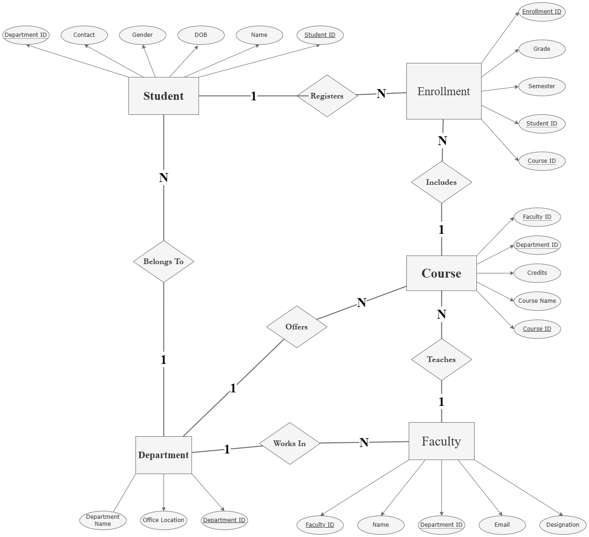

# DB Lab – College Database (ER → Relational → SQL)

This repository contains **Database Design Lab – 02** based on a **College Database**. The lab focuses on:

- Designing **ER Diagram**
- Converting ER to **Relational Tables**
- Implementing schema using **SQL (DDL)** on Oracle

---

## Objective

To understand **Entity–Relationship (ER) modeling**, convert it into **relational tables**, and implement them using SQL.

---

## Entities Used

- Department
- Student
- Faculty
- Course
- Enrollment

---

## ER Diagram



---

## Relational Schema


---

## Tables Used

- Department
- Student
- Faculty
- Course
- Enrollment

---

## Topics Covered

### Part A – ER Modeling

- Identify entities & attributes
- Assign Primary Keys
- Define relationships
- Show cardinality (1–N / N–1)
- Convert M–N using Enrollment table

---

### Part B – Relational Tables

- Convert ER to tables
- Assign Primary & Foreign Keys

---

### Part C – SQL (DDL)

- Create Department table
- Create Student table
- Create Faculty table
- Create Course table
- Create Enrollment table
- Apply PK & FK constraints

---

## Table Structures

### Department

| Column         | Type       |
| -------------- | ---------- |
| DepartmentID   | CHAR(5) PK |
| DepartmentName | VARCHAR    |
| OfficeLocation | VARCHAR    |

---

### Student

| Column       | Type       |
| ------------ | ---------- |
| StudentID    | CHAR(5) PK |
| Name         | VARCHAR    |
| DOB          | DATE       |
| Gender       | VARCHAR    |
| ContactNo    | NUMBER     |
| DepartmentID | CHAR(5) FK |

---

### Faculty

| Column       | Type       |
| ------------ | ---------- |
| FacultyID    | CHAR(5) PK |
| Name         | VARCHAR    |
| Designation  | VARCHAR    |
| Email        | VARCHAR    |
| DepartmentID | CHAR(5) FK |

---

### Course

| Column       | Type       |
| ------------ | ---------- |
| CourseID     | CHAR(5) PK |
| CourseName   | VARCHAR    |
| Credits      | NUMBER     |
| DepartmentID | CHAR(5) FK |
| FacultyID    | CHAR(5) FK |

---

### Enrollment

| Column       | Type       |
| ------------ | ---------- |
| EnrollmentID | CHAR(5) PK |
| StudentID    | CHAR(5) FK |
| CourseID     | CHAR(5) FK |
| Semester     | CHAR       |
| Grade        | VARCHAR    |

---

## SQL Implementation

```sql
DROP TABLE Enrollment;
DROP TABLE Course;
DROP TABLE Student;
DROP TABLE Faculty;
DROP TABLE Department;

CREATE TABLE Department (
    DepartmentID CHAR(5) PRIMARY KEY,
    DepartmentName VARCHAR(10),
    OfficeLocation VARCHAR(10)
);

CREATE TABLE Student (
    StudentID CHAR(5) PRIMARY KEY,
    Name VARCHAR(20),
    DOB DATE,
    Gender VARCHAR(6),
    ContactNo NUMBER(10),
    DepartmentID CHAR(5),
    FOREIGN KEY (DepartmentID) REFERENCES Department(DepartmentID)
);

CREATE TABLE Faculty (
    FacultyID CHAR(5) PRIMARY KEY,
    Name VARCHAR(25),
    Designation VARCHAR(15),
    Email VARCHAR(40),
    DepartmentID CHAR(5),
    FOREIGN KEY (DepartmentID) REFERENCES Department(DepartmentID)
);

CREATE TABLE Course (
    CourseID CHAR(5) PRIMARY KEY,
    CourseName VARCHAR(10),
    Credits NUMBER(2),
    DepartmentID CHAR(5),
    FacultyID CHAR(5),
    FOREIGN KEY (DepartmentID) REFERENCES Department(DepartmentID),
    FOREIGN KEY (FacultyID) REFERENCES Faculty(FacultyID)
);

CREATE TABLE Enrollment (
    EnrollmentID CHAR(5) PRIMARY KEY,
    StudentID CHAR(5),
    CourseID CHAR(5),
    Semester CHAR(3),
    Grade VARCHAR(2),
    FOREIGN KEY (StudentID) REFERENCES Student(StudentID),
    FOREIGN KEY (CourseID) REFERENCES Course(CourseID)
);
```

---

## How to Run (Oracle 21c XE)

1. Open SQL Plus / SQL Developer
2. Login using Oracle credentials
3. Run SQL file or paste queries
4. Execute step by step

---

## Files Included

- Lab 02 Questions.pdf
- Lab 02 Solution.sql
- ER Diagram.png
- Relational Table.png

### ---


